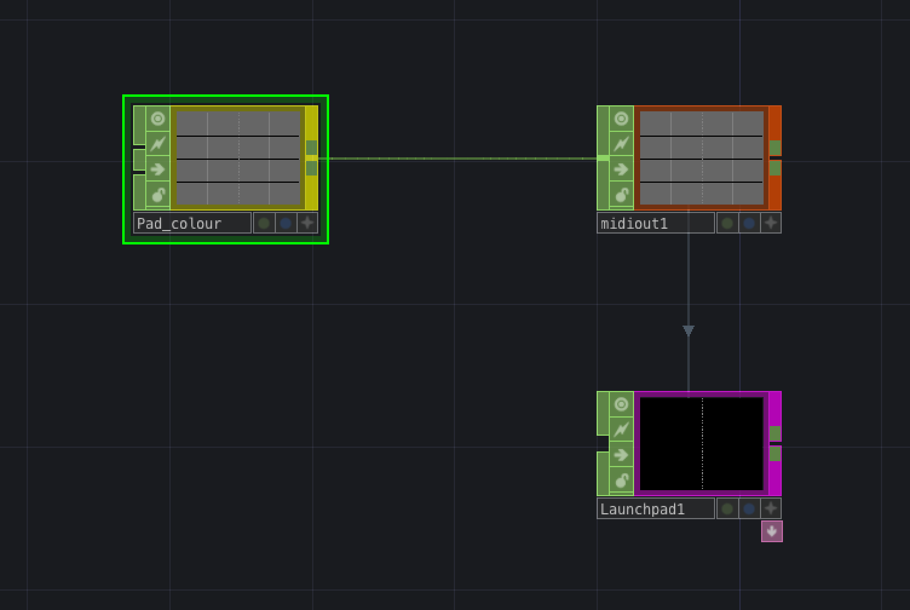
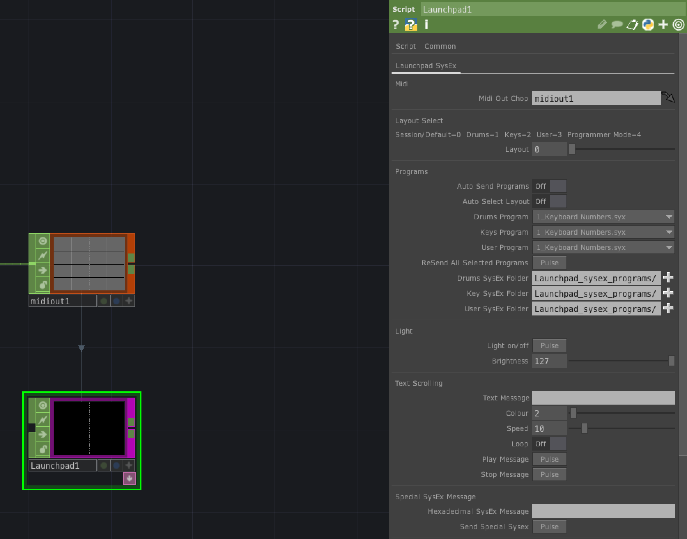

# Launchpad Mini MK3 SysEx

Tox for sending presets/programs, and other SysEx messages on the Novation Launchpad Mini MK3.

## About This Fork - 2025-01-29

TouchDesigner099 version used for creating this tox: 2023.11880
Nothing was changed regarding the SysEx communication between TouchDesigner and the LaunchPad.

A color picker example was added as an attempt to be able to select the pad color using RGB values in TouchDesigner.

### Network Example

### Launchpad1 Operator Parameters Example

## Getting Started

1. Install TouchDesigner099
2. Open Launchpad_sysex_programs/Launchpad_mini_mk3_sysex.tox
3. Map the Launchpad Mini MK3: 'Dialogs' -> 'MIDI Device Mapper.'

## Compatibility

TouchDesigner099 Build 2021.16960

Novation Launchpad MK3 (Possibly others, I haven't tested)